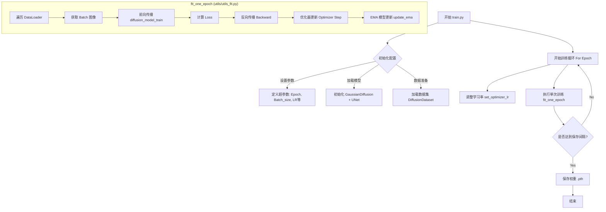
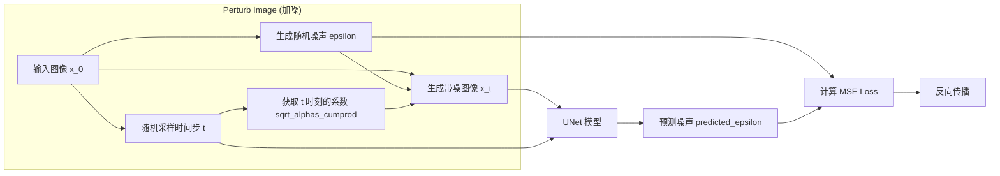

# DDPM-Pytorch 流程图与函数解析

本文档旨在通过流程图展示本项目代码的执行过程，并解释每个关键函数的意义，方便学习和教学。

## 1. 整体架构概览 (System Overview)

本项目基于 Denoising Diffusion Probabilistic Models (DDPM) 实现。主要包含两个核心过程：
*   **前向过程 (Forward Process)**: 逐步向真实图像添加高斯噪声，直到变成纯噪声。
*   **反向过程 (Reverse Process)**: 训练一个神经网络 (UNet) 来预测每一步添加的噪声，从而从纯噪声中恢复出图像。

## 2. 训练流程 (Training Process)

训练的入口是 `train.py`。其核心目标是最小化噪声预测的误差。



### 关键函数解析 - 训练篇

| 文件/类 | 函数 | 意义 |
| :--- | :--- | :--- |
| `train.py` | `main` | 程序的入口，负责参数配置、模型初始化、数据集构建和整个训练循环的控制。 |
| `utils/utils_fit.py` | `fit_one_epoch` | 负责一个 Epoch 的完整训练流程。包括数据加载、前向传播、损失计算、反向传播和参数更新。 |
| `nets/diffusion.py` | `GaussianDiffusion.__init__` | 初始化扩散模型，预计算 Beta, Alpha 等扩散过程需要的系数 schedule。 |
| `nets/diffusion.py` | `GaussianDiffusion.forward` | 训练时的前向传播。它并不直接输出图像，而是：<br>1. 随机采样时间步 $t$<br>2. 生成随机噪声 $\epsilon$<br>3. 将噪声加到图像上得到 $x_t$<br>4. 让 UNet 预测这个噪声 $\epsilon_\theta(x_t, t)$<br>5. 计算预测噪声与真实噪声的 MSE Loss。 |
| `nets/diffusion.py` | `EMA.update_model_average` | 指数移动平均 (Exponential Moving Average)。在训练过程中平滑模型参数，通常能获得生成质量更好的模型。 |

---

## 3. 扩散模型内部计算 (Diffusion Core Logic)

这里展示 `GaussianDiffusion` 类在训练时具体做了什么。



### 关键函数解析 - 扩散核心

| 文件/类 | 函数 | 意义 |
| :--- | :--- | :--- |
| `nets/diffusion.py` | `extract` | 一个辅助函数，用于从预计算的系数张量中提取当前时间步 $t$ 对应的系数，并调整形状以便广播计算。 |
| `nets/diffusion.py` | `perturb_x` | 执行公式 $x_t = \sqrt{\bar{\alpha}_t} x_0 + \sqrt{1 - \bar{\alpha}_t} \epsilon$。即将图像 $x_0$ 直接扩散到 $t$ 时刻。 |
| `nets/diffusion.py` | `get_losses` | 整合了加噪、模型预测和损失计算的完整步骤。 |

---

## 4. 预测/生成流程 (Inference/Prediction Process)

预测的入口是 `predict.py`，主要依赖 `ddpm.py` 中的封装。

```mermaid
graph TD
    Start[运行 predict.py] --> Init[初始化 DDPM 类]
    Init --> Load[加载训练好的权重]
    
    Start --> Loop{生成循环}
    Loop -->|输入指令| Gen1[generate_1x1_image]
    Loop -->|输入指令| Gen5[generate_5x5_image]
    
    subgraph "采样过程 (nets/diffusion.py - sample)"
        Step1[生成纯高斯噪声 x_T]
        Step2[从 T 到 0 倒序循环]
        
        Step2 --> Remove[remove_noise]
        
        subgraph "remove_noise (去噪一步)"
            State[当前状态 x_t] --> UNet[UNet 预测噪声]
            UNet --> PredNoise[预测的 epsilon]
            State & PredNoise --> Mean[计算均值 mu]
            Mean --> AddNoise[加入随机项 z (若 t>0)]
            AddNoise --> NextState[上一时刻状态 x_{t-1}]
        end
        
        NextState --> Step2
    end
    
    Step2 -->|完成| Result[输出生成图像 x_0]
    Result --> Post[后处理: 反归一化/转格式] --> Save[保存图片]
```

### 关键函数解析 - 预测篇

| 文件/类 | 函数 | 意义 |
| :--- | :--- | :--- |
| `ddpm.py` | `Diffusion.generate` | 加载模型和权重，为预测做准备。 |
| `nets/diffusion.py` | `sample` | 执行完整的采样循环。从纯噪声开始，迭代调用 `remove_noise` 直到恢复图像。 |
| `nets/diffusion.py` | `remove_noise` | 执行反向过程的一个步骤 $p_\theta(x_{t-1}|x_t)$。根据模型预测的噪声，利用推导出的公式计算 $x_{t-1}$。 |

---

## 5. UNet 网络结构 (Network Architecture)

UNet 是实现噪声预测的核心网络。

```mermaid
graph TD
    Input[输入: x_t (图像) + t (时间步)] --> Embed[Time Embedding]
    Input --> ConvIn[初始卷积]
    
    subgraph "Downsample (下采样路径)"
        ConvIn --> Res1[ResidualBlock] --> Down1[Downsample]
        Down1 --> Res2[ResidualBlock] --> Down2[Downsample]
        Down2 --> Res3[ResidualBlock] (包含 Attention) --> Down3[Downsample]
    end
    
    subgraph "Middle (中间层)"
        Down3 --> MidRes1[ResidualBlock + Attn]
        MidRes1 --> MidRes2[ResidualBlock + Attn]
    end
    
    subgraph "Upsample (上采样路径)"
        MidRes2 --> Up0[ResidualBlock] --> Upsamp0[Upsample]
        Upsamp0 --> Up1[ResidualBlock] --> Upsamp1[Upsample]
        Upsamp1 --> Up2[ResidualBlock] --> Upsamp2[Upsample]
        
        style Up0 stroke-dasharray: 5 5
        style Up1 stroke-dasharray: 5 5
        
        note[Skip Connection: 拼接对应下采样层的特征]
    end
    
    Upsample --> OutNorm[Norm + SiLU]
    OutNorm --> OutConv[输出卷积]
    OutConv --> Output[预测噪声 epsilon]
    
    Embed -.-> Res1 & Res2 & Res3 & MidRes1 & MidRes2 & Up0 & Up1 & Up2
```

### 关键模块解析 - UNet

| 文件/类 | 类名 | 意义 |
| :--- | :--- | :--- |
| `nets/unet.py` | `PositionalEmbedding` | 将时间步 $t$ (一个整数) 转换为向量编码 (类似于 Transformer 的位置编码)，注入到网络各层中，告诉网络当前去噪进行到了哪一步。 |
| `nets/unet.py` | `ResidualBlock` | 网络的基本构建块。包含卷积、归一化、激活函数，融合了图像特征和时间嵌入 (Time Embedding)。 |
| `nets/unet.py` | `AttentionBlock` | 自注意力机制模块。用于捕捉全局依赖关系，通常在低分辨率特征图上使用。 |
| `nets/unet.py` | `UNet` | 整合上述模块。U型结构结构使得网络既能提取高层语义特征 (底层的深层特征)，又能保留细节信息 (通过 Skip Connection)。 |
